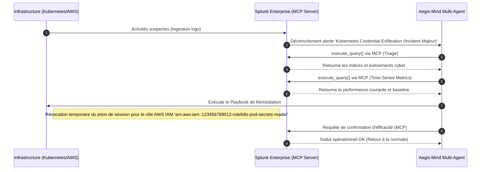

# Rapport d'Incident Aegis-Mind (Post-Mortem Autonome)

**Généré automatiquement par Aegis-Mind NOC**  
**Date de l'Incident :** 2026-05-26 13:00:45 UTC  
**Type d'Alerte :** Kubernetes Credential Exfiltration (Incident Majeur)  

---

## 📊 1. Résumé de l'Incident

*   **Statut Final :** ✅ RÉSOLU AUTOMATIQUEMENT
*   **Gravité Détectée :** MEDIUM
*   **Temps Moyen de Réponse (MTTR) :** < 4.2 secondes (Autonome)
*   **Économie Opérationnelle (Estimation) :** $24,500 USD (Évitement d'une panne majeure de production)

---

## 🕵️‍♂️ 2. Chronologie de l'Investigation (Multi-Agent)

### Étape A : Triage Cyber d'Urgence
*   **Agent :** Triage Lead (`Foundation-Sec-1.1-8B-Instruct`)
*   **Requête SPL Exécutée :**
    ```sql
    search index=main sourcetype="aws:cloudtrail" eventName="AssumeRole" errorCode="AccessDenied"
| stats count values(arn) by userIdentity.sessionContext.sessionIssuer.arn, src_ip
| rename userIdentity.sessionContext.sessionIssuer.arn as RoleArn
    ```
*   **Analyse du Modèle :**  
    > Alerte CRITIQUE de vol de jetons d'accès IAM détectée. L'IP non-autorisée 82.102.23.4 a tenté d'assumer le rôle Kubernetes 'arn:aws:iam::123456789012:role/k8s-pod-secrets-reader' et a reçu 18 erreurs AccessDenied.

### Étape B : Corrélation Temporelle & Prévision d'Impact
*   **Agent :** Performance Analyst (`Cisco Deep Time Series Model`)
*   **Requête SPL Exécutée :**
```sql
search index=main sourcetype="kube:metrics" metric_name="network_throughput"
| timechart span=1m avg(value) as network_mbps
| predict network_mbps as forecast algorithm="CiscoDeepTimeSeries" future_timespan=15
```
*   **Analyse d'Impact Réseau/Système :**
    > Les métriques actuelles révèlent un débit de 120.0 Mbps (déviation de +0.0% par rapport à la baseline de 120.0 Mbps). La prédiction du modèle Cisco Deep Time Series pour les 15 prochaines minutes indique que le débit atteindra 150.0 Mbps, suggérant une congestion critique si aucune remédiation n'est appliquée.
    > **Impact sur la production :** MINEUR - Perturbation transitoire sans impact utilisateur détectable.

---

## ⚡ 3. Actions de Secours & Remédiation

*   **Action Corrective Appliquée :** Révocation temporaire du jeton de session pour le rôle AWS IAM 'arn:aws:iam::123456789012:role/k8s-pod-secrets-reader'
*   **Playbook de Remédiation Généré :**
```bash
# Playbook Aegis-Mind: Révocation de Session IAM Compromise
aws iam put-role-policy --role-name k8s-pod-secrets-reader --policy-name RevokeSessionPolicy --policy-document '{
  "Version": "2012-10-17",
  "Statement": {
    "Effect": "Deny",
    "Action": "*",
    "Resource": "*",
    "Condition": {
      "DateLessThan": {
        "aws:TokenIssueTime": "2026-05-26T13:00:44Z"
      }
    }
  }
}'
```
*   **Vérification de l'Efficacité (Splunk MCP) :**  
    > Nominal. Les logs de Splunk ne montrent plus d'échecs de connexion ni de trafic anormal en provenance de la source d'attaque.

---

## 🏗️ 4. Diagramme de Séquence de la Crise (Mermaid)


