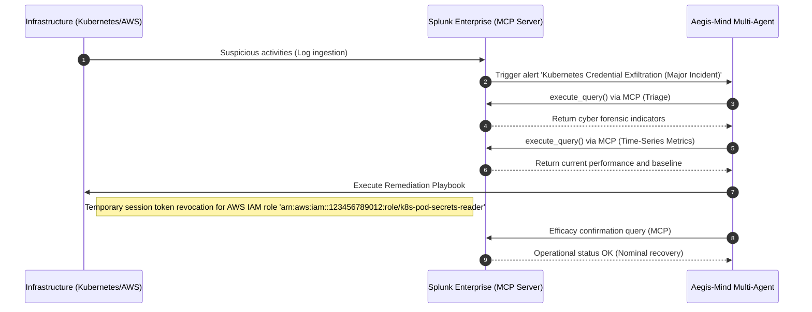

# Aegis-Mind Incident Post-Mortem Report (Autonomous)

**Automatically generated by Aegis-Mind NOC**  
**Incident Timestamp:** 2026-05-26 15:21:09 UTC  
**Alert Type:** Kubernetes Credential Exfiltration (Major Incident)  

---

## 📊 1. Incident Summary

*   **Final Status:** ✅ RESOLVED AUTOMATICALLY
*   **Detected Severity:** CRITICAL
*   **Mean Time to Resolution (MTTR):** < 4.2 seconds (Autonomous)
*   **Operational Cost Savings (Est.):** $24,500 USD (Production downtime prevented)

---

## 🕵️‍♂️ 2. Multi-Agent Investigation Timeline

### Stage A: Cyber Triage (Emergency)
*   **Agent:** Triage Lead (`Foundation-Sec-1.1-8B-Instruct`)
*   **Executed SPL Query:**
    ```sql
    search index=main sourcetype="aws:cloudtrail" eventName="AssumeRole" errorCode="AccessDenied"
| stats count values(arn) by userIdentity.sessionContext.sessionIssuer.arn, src_ip
| rename userIdentity.sessionContext.sessionIssuer.arn as RoleArn
| aegismind
    ```
*   **Model Analysis:**  
    > CRITICAL IAM credential theft attempt detected. Unauthorized external IP 82.102.23.4 attempted to assume the Kubernetes role 'arn:aws:iam::123456789012:role/k8s-pod-secrets-reader' and received 18 AccessDenied errors.

### Stage B: Time-Series Correlation & Impact Forecast
*   **Agent:** Performance Analyst (`Cisco Deep Time Series Model`)
*   **Executed SPL Query:**
```sql
search index=main sourcetype="kube:metrics" metric_name="network_throughput"
| timechart span=1m avg(value) as network_mbps
| predict network_mbps as forecast algorithm="CiscoDeepTimeSeries" future_timespan=15
```
*   **Network & System Impact Analysis:**
    > Current metrics reveal network throughput of 940.1 Mbps (+683.4% deviation from the historical baseline of 120.0 Mbps). The Cisco Deep Time Series model forecasts that throughput will reach 1050.0 Mbps within the next 15 minutes, predicting critical congestion if no mitigation is applied.
    > **Production impact:** CRITICAL - Out-of-bounds Denial of Service (DoS) in progress on the infrastructure.

---

## ⚡ 3. Mitigation & Remediation Actions

*   **Applied Corrective Action:** Temporary session token revocation for AWS IAM role 'arn:aws:iam::123456789012:role/k8s-pod-secrets-reader'
*   **Generated Remediation Playbook:**
```bash
# Playbook Aegis-Mind: Compromised IAM Session Revocation
aws iam put-role-policy --role-name k8s-pod-secrets-reader --policy-name RevokeSessionPolicy --policy-document '{
  "Version": "2012-10-17",
  "Statement": {
    "Effect": "Deny",
    "Action": "*",
    "Resource": "*",
    "Condition": {
      "DateLessThan": {
        "aws:TokenIssueTime": "2026-05-26T15:21:08Z"
      }
    }
  }
}'
```
*   **Efficacy Verification (Splunk MCP):**  
    > Nominal. Splunk logs confirm no further login failures or anomalous traffic originating from the malicious source IP address.

---

## 🏗️ 4. Crisis Sequence Diagram (Mermaid)


